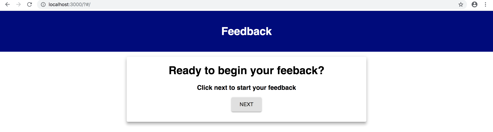
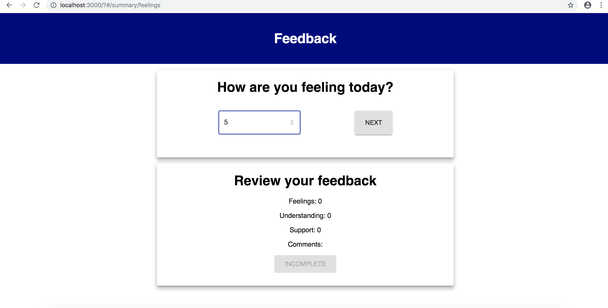
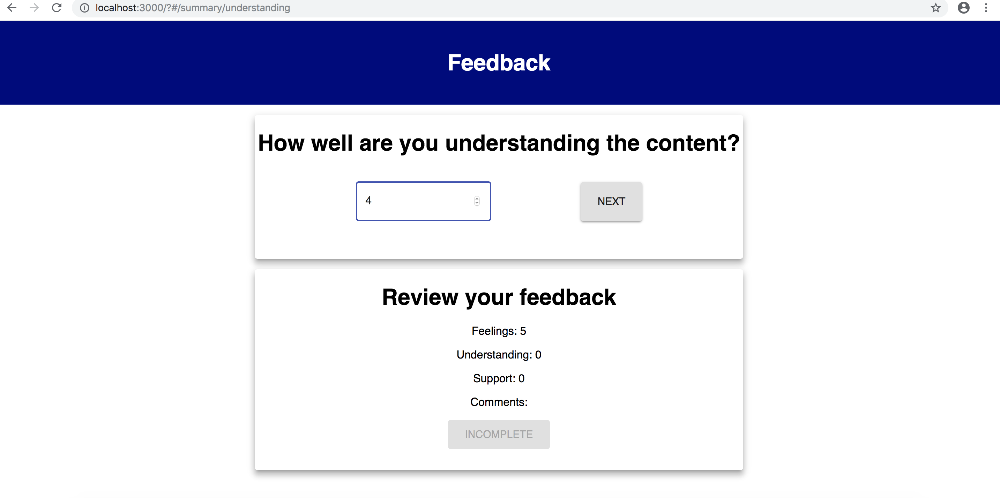
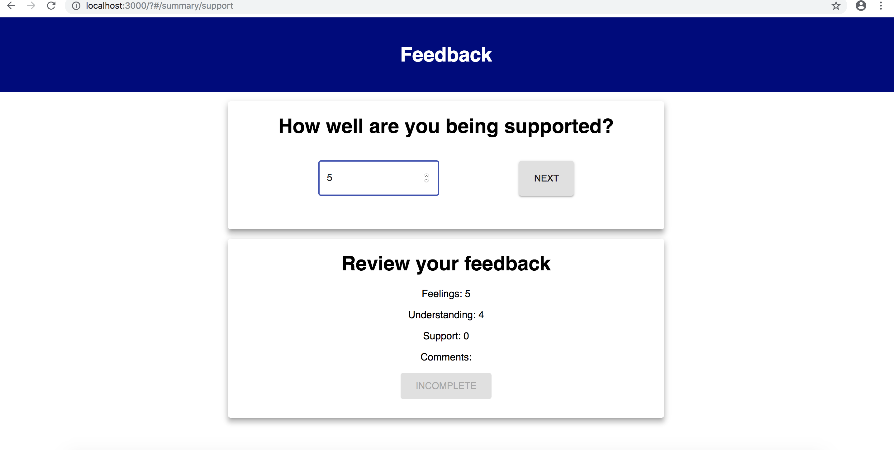
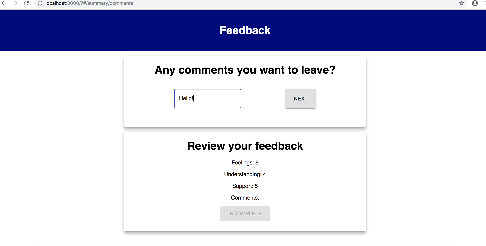
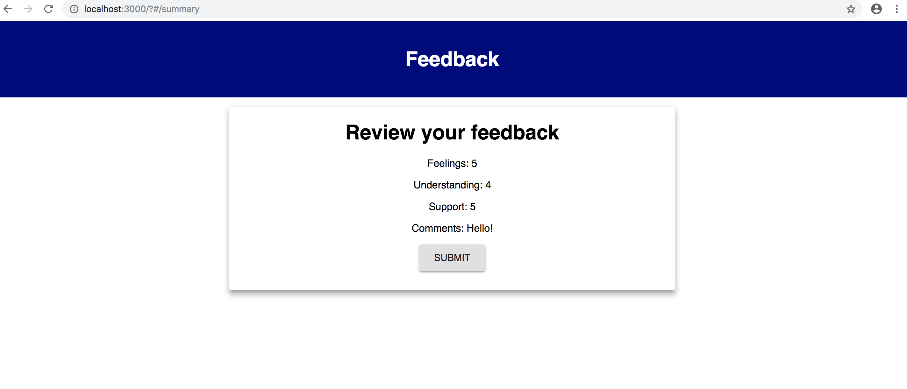
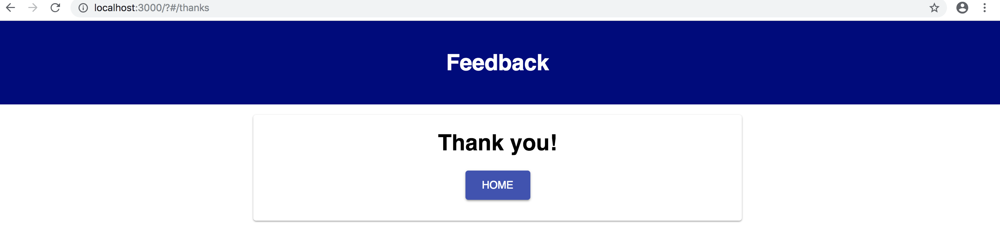

# Redux Feedback Loop

## Prerequisites/Software Used

- Node.js
- Postico
- Terminal
- React
- Redux

## Installing

- Download project
- `npm install`
- `createdb prime_feedback`
- `npm run server`
- `npm run client`

## Screen Shots

### 1 Home Page

### 2 Feelings Page

### 3 Understanding Page

### 4 Support Page

### 5 Comments Page

### 6 Summary Page

### 7 Thanks Page

## Documentation

- [Link to orginal assignment:](https://github.com/PrimeAcademy/weekend-challenge-5-feedback)

## Completed Features

- Routing that moves the app in the proper direction.
- Buttons on each page that move the app to the next page.
- Input fields on certain pages whose contents are stored via redux.
- Summary of the information currently in Redux displayed on certain pages.
- The summary included on certain pages also contains a conditionally rendered button.
The button does is disabled until all fields have been filled.
- A page at the end of the program displays the summary and allows the user to submit
the feedback to the database.
- The last page thanks the user and sends them to the home page when they click the  button on the page.

## Future Features

- Add a nav bar to navigate between pages easier.
- Validation for the input information.
- Improve upon the styling of the project(add icons, etc.).
- Add an Admin page to flag an existing entry for review.
- Deployment to Heroku.

## Deployment

- Plans to deploy to Heroku.

## Author

- Maxwell Todd

## Acknowledgements
- I would like to thank Chris Black, Luke Schlangen, Kris Szfranski, and Dane aka DoctorHowser for the base assignment code.
- I would additionally like to thank my cohort mates at Prime for supporting me.